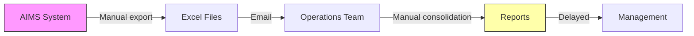
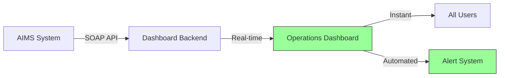

# Business Requirements Document (BRD)
## Aviation Operations Dashboard - AIMS Integration

**Version:** 1.0  
**Ngày:** 30/01/2026  
**Phòng ban:** Flight Operations

---

## 1. Executive Summary

### 1.1 Mục đích
Tài liệu này định nghĩa các yêu cầu kinh doanh cho việc xây dựng Aviation Operations Dashboard, một giải pháp tích hợp dữ liệu từ hệ thống AIMS thông qua SOAP Web Service để cung cấp visibility toàn diện về hoạt động vận hành hàng không.

### 1.2 Business Problem
| Vấn đề hiện tại | Tác động | Giải pháp đề xuất |
|-----------------|----------|-------------------|
| Dữ liệu crew phân tán nhiều nguồn | Mất 15-20 phút tra cứu | Dashboard tập trung |
| Giám sát FTL thủ công | Rủi ro vi phạm quy định | Automated alerts |
| Báo cáo trễ và thiếu chính xác | Quyết định không kịp thời | Real-time data sync |
| Khó theo dõi crew availability | Scheduling conflicts | Live status board |

### 1.3 Business Opportunity
- Giảm **40%** thời gian tác nghiệp cho Operations team
- Đảm bảo **100%** compliance với FTL regulations
- Cải thiện crew utilization thông qua data-driven decisions

---

## 2. Business Objectives

### 2.1 Strategic Alignment
```
┌─────────────────────────────────────────────────────────┐
│              Company Strategic Goals                     │
├─────────────────────────────────────────────────────────┤
│  ┌─────────────────┐   ┌─────────────────┐             │
│  │ Operational     │   │ Safety &        │             │
│  │ Excellence      │   │ Compliance      │             │
│  └────────┬────────┘   └────────┬────────┘             │
│           │                     │                       │
│           ▼                     ▼                       │
│  ┌──────────────────────────────────────────────┐      │
│  │    Aviation Operations Dashboard              │      │
│  │    - Real-time visibility                     │      │
│  │    - Automated compliance monitoring          │      │
│  │    - Data-driven resource optimization        │      │
│  └──────────────────────────────────────────────┘      │
└─────────────────────────────────────────────────────────┘
```

### 2.2 SMART Objectives

| # | Objective | Specific | Measurable | Target Date |
|---|-----------|----------|------------|-------------|
| 1 | Giảm thời gian tra cứu crew | Từ 15 phút xuống < 1 phút | Đo bằng user testing | Q1 2026 |
| 2 | Tự động hóa FTL monitoring | Manual → Automated | Coverage 100% crew | Q2 2026 |
| 3 | Cải thiện data accuracy | Reduce discrepancies | Error rate < 1% | Q2 2026 |
| 4 | Tăng reporting efficiency | Real-time thay vì daily | Latency < 5 mins | Q1 2026 |

---

## 3. Stakeholder Analysis

### 3.1 Stakeholder Map

| Stakeholder | Interest Level | Influence | Needs |
|-------------|---------------|-----------|-------|
| VP Operations | High | High | Executive dashboard, KPIs |
| Crew Managers | High | Medium | Scheduling tools, roster view |
| Flight Dispatchers | High | Medium | Flight status, delay tracking |
| Safety Officers | Medium | High | Compliance reports, alerts |
| IT Department | Medium | Medium | System maintainability |
| Finance | Low | Medium | Cost reports, utilization data |

### 3.2 RACI Matrix

| Activity | VP Ops | Crew Mgr | IT | Safety | Finance |
|----------|--------|----------|-----|--------|---------|
| Requirements approval | A | R | C | C | I |
| System implementation | I | C | R | C | I |
| UAT Testing | A | R | C | R | I |
| Go-live decision | A | C | R | C | I |
| Ongoing operations | I | R | R | C | I |

*R=Responsible, A=Accountable, C=Consulted, I=Informed*

---

## 4. Regulatory & Compliance Requirements

### 4.1 Flight Time Limitations (FTL)

> [!IMPORTANT]
> Hệ thống PHẢI hỗ trợ monitoring các giới hạn FTL theo quy định EASA/CAAV:

| Regulation | Limit | Monitoring Requirement |
|------------|-------|------------------------|
| Daily FDP | Max 13 hours | Real-time tracking |
| Weekly flight hours | Max 60 hours | Rolling 7-day calculation |
| 28-day flight hours | Max 100 hours | Rolling 28-day calculation |
| 12-month flight hours | Max 1000 hours | Annual limit warning |
| Rest period | Min 10-12 hours | Post-duty verification |

### 4.2 Data Privacy & Security
- Crew personal data phải tuân thủ Data Protection regulations
- Access control based on job function (need-to-know basis)
- Audit trail cho mọi data access và modifications

---

## 5. Business Process Impact

### 5.1 Current State (As-Is)



**Pain Points:**
- 2-3 giờ delay trong reporting
- Dữ liệu không nhất quán giữa các sources
- Thiếu real-time visibility

### 5.2 Future State (To-Be)



**Benefits:**
- Real-time data access (< 5 mins latency)
- Single source of truth
- Proactive alerting

---

## 6. Business Value & ROI

### 6.1 Quantitative Benefits

| Benefit Category | Current State | Future State | Annual Savings |
|------------------|---------------|--------------|----------------|
| Time saved (Ops team) | 3 hrs/day manual work | 0.5 hrs/day | ~$25,000 |
| FTL violations avoided | 2-3 incidents/year | 0 | ~$50,000 (penalties) |
| Improved crew utilization | - | +5% efficiency | ~$100,000 |
| **Total Estimated Value** | | | **~$175,000/year** |

### 6.2 Qualitative Benefits
- Enhanced safety culture through proactive monitoring
- Better crew satisfaction từ fair scheduling
- Improved regulatory relationship
- Data-driven decision making capability

### 6.3 Investment Required

| Item | Cost |
|------|------|
| Development | $XX,XXX |
| AIMS API licensing | Existing |
| Infrastructure (Cloud) | $5,000/year |
| Training | $3,000 |
| **Total Investment** | ~$XX,XXX |

**ROI Timeline:** 8-12 months

---

## 7. Risk Assessment

| Risk | Probability | Impact | Mitigation |
|------|-------------|--------|------------|
| AIMS API downtime | Medium | High | Fallback to CSV upload |
| Data quality issues | Medium | Medium | Validation rules, alerts |
| User adoption resistance | Low | Medium | Training, change management |
| Scope creep | Medium | Medium | Strict change control |
| Integration complexity | Medium | High | Phased implementation |

---

## 8. Success Criteria

### 8.1 Go-Live Criteria
- [ ] All Must-have features implemented và tested
- [ ] UAT signed off by Operations stakeholders
- [ ] Security audit passed
- [ ] Performance benchmarks met (< 3s load time)
- [ ] User training completed

### 8.2 Post-Launch KPIs (6 months)

| KPI | Target | Measurement Method |
|-----|--------|-------------------|
| User adoption rate | > 90% | Active users / Total users |
| System uptime | > 99.5% | Monitoring logs |
| Data accuracy | > 99% | Discrepancy reports |
| User satisfaction | > 4.0/5.0 | Survey |
| FTL alerts accuracy | 100% | Validation vs actual |

---

## 9. Business Constraints

### 9.1 Budget
- Capital expenditure approved for FY2026
- Ongoing operational costs within IT budget

### 9.2 Timeline
- Project must be completed within 12 weeks
- Phased rollout preferred to minimize disruption

### 9.3 Resources
- IT team available part-time (shared with other projects)
- Operations SMEs available for requirements và testing

### 9.4 Technical
- Must integrate with existing AIMS system via SOAP
- Supabase được chọn làm database platform
- Flask backend với responsive web frontend

---

## 10. Approval

| Role | Name | Signature | Date |
|------|------|-----------|------|
| Project Sponsor | | | |
| VP Operations | | | |
| IT Director | | | |
| Finance | | | |

---

## Appendix: Acronyms

| Term | Definition |
|------|------------|
| AIMS | Airline Information Management System |
| BRD | Business Requirements Document |
| FTL | Flight Time Limitations |
| FDP | Flight Duty Period |
| EASA | European Aviation Safety Agency |
| CAAV | Civil Aviation Authority of Vietnam |
| UAT | User Acceptance Testing |
| ROI | Return on Investment |
| SME | Subject Matter Expert |
