# Data Workflow Documentation
## Aviation Operations Dashboard - ETL & Data Pipeline

**Version:** 1.0  
**Ngày:** 30/01/2026

---

## 1. Data Sources Overview

### 1.1 Primary Data Sources

| Source | Type | Frequency | Data |
|--------|------|-----------|------|
| AIMS SOAP API | Real-time | Every 5 mins | Crew, Flights, Aircraft |
| CSV Upload | Fallback | Manual | All data types |
| Supabase | Database | Persistent | Processed data |

### 1.2 Data Flow Architecture


---

## 2. ETL Pipeline Details

### 2.1 Crew Data Pipeline

```mermaid
sequenceDiagram
    participant Scheduler
    participant AIMS
    participant Processor
    participant DB
    
    Note over Scheduler: Every 5 minutes
    Scheduler->>AIMS: GetCrewList(period=today±7days)
    AIMS-->>Processor: TAIMSGetCrewList[]
    
    loop For each crew
        Processor->>Processor: Validate crew_id
        Processor->>Processor: Normalize name
        Processor->>Processor: Parse qualifications
    end
    
    Processor->>DB: UPSERT crew_members
    Processor->>DB: UPSERT crew_qualifications
    
    Note over Processor: Calculate derived metrics
    Processor->>AIMS: CrewMemberRosterDetailsForPeriod()
    AIMS-->>Processor: TAIMSCrewRostDetailList[]
    Processor->>DB: UPSERT crew_roster
```



### 2.2 Flight Data Pipeline


### 2.3 FTL Calculation Pipeline

```mermaid
flowchart LR
    A[Crew Roster Data] --> B{Group by<br/>Crew ID}
    B --> C[Calculate<br/>28-day Hours]
    B --> D[Calculate<br/>12-month Hours]
    C --> E{Check Limits}
    D --> E
    E -->|> 85%| F[WARNING Status]
    E -->|> 95%| G[CRITICAL Status]
    E -->|≤ 85%| H[NORMAL Status]
    F --> I[(crew_flight_hours)]
    G --> I
    H --> I
    G --> J[Generate Alert]
```



---

## 3. Data Transformation Rules

### 3.1 Crew Data Transformation

| Source Field (AIMS) | Target Field | Transformation |
|---------------------|--------------|----------------|
| `CrewID` | `crew_id` | Convert to string, trim |
| `CrewName` | `crew_name` | Title case |
| `FirstName` + `LastName` | `full_name` | Concatenate with space |
| `Crew3LC` | `three_letter_code` | Upper case |
| `Gender` | `gender` | Validate M/F |
| `EmployBeg` | `employment_begin` | Parse DD/MM/YYYY → DATE |

### 3.2 Crew Status Mapping

| AIMS Duty Code | System Status | Description |
|----------------|---------------|-------------|
| Flight duty | `FLY` | Operating flights |
| `SBY`, `STBY` | `SBY` | Standby |
| `SL`, `SICK` | `SL` | Sick Leave |
| `CSL` | `CSL` | Call Sick |
| `OFF`, `DO` | `OFF` | Day Off |
| `TRN`, `SIM` | `TRN` | Training |
| `LVE`, `AL` | `LVE` | Annual Leave |

### 3.3 Time Transformation

```python
def transform_aims_datetime(dd: str, mm: str, yy: str, 
                            hh: str = "00", mins: str = "00") -> datetime:
    """
    Transform AIMS split date/time to Python datetime
    AIMS uses: DD, MM, YY (or YYYY), HH, MM separately
    """
    # Handle 2-digit vs 4-digit year
    year = int(yy) if len(yy) == 4 else 2000 + int(yy)
    
    dt = datetime(
        year=year,
        month=int(mm),
        day=int(dd),
        hour=int(hh),
        minute=int(mins),
        tzinfo=pytz.UTC
    )
    return dt

# Example: DD=30, MM=01, YY=26, HH=15, MM=30
# Result: 2026-01-30 15:30:00 UTC
```

---

## 4. Data Validation Rules

### 4.1 Crew Validation

```python
VALIDATION_RULES = {
    'crew_id': {
        'required': True,
        'type': str,
        'pattern': r'^\d{4,6}$',  # 4-6 digits
        'error': 'Invalid crew ID format'
    },
    'crew_name': {
        'required': True,
        'type': str,
        'min_length': 2,
        'max_length': 100,
        'error': 'Invalid crew name'
    },
    'gender': {
        'required': False,
        'type': str,
        'allowed': ['M', 'F', None],
        'error': 'Gender must be M or F'
    },
    'email': {
        'required': False,
        'type': str,
        'pattern': r'^[\w\.-]+@[\w\.-]+\.\w+$',
        'error': 'Invalid email format'
    }
}
```

### 4.2 Flight Validation

| Field | Validation | Action on Fail |
|-------|------------|----------------|
| `flight_number` | Integer > 0 | Reject record |
| `departure`, `arrival` | 3-char IATA code | Reject record |
| `std`, `sta` | Valid time | Reject record |
| `aircraft_reg` | Pattern match | Warning log |
| `delay_minutes` | Integer ≥ 0 | Set to 0 |

---

## 5. Sync Scheduling

### 5.1 APScheduler Configuration

```python
from apscheduler.schedulers.background import BackgroundScheduler
from apscheduler.triggers.interval import IntervalTrigger

scheduler = BackgroundScheduler()

# Crew sync - every 5 minutes
scheduler.add_job(
    func=sync_crew_data,
    trigger=IntervalTrigger(minutes=5),
    id='crew_sync',
    name='Sync crew data from AIMS',
    replace_existing=True
)

# Flight sync - every 5 minutes
scheduler.add_job(
    func=sync_flight_data,
    trigger=IntervalTrigger(minutes=5),
    id='flight_sync',
    name='Sync flight data from AIMS',
    replace_existing=True
)

# FTL calculation - every 15 minutes
scheduler.add_job(
    func=calculate_ftl_hours,
    trigger=IntervalTrigger(minutes=15),
    id='ftl_calc',
    name='Calculate FTL hours for all crew',
    replace_existing=True
)

# Full qualifications sync - daily at 02:00
scheduler.add_job(
    func=sync_qualifications,
    trigger=CronTrigger(hour=2, minute=0),
    id='qual_sync',
    name='Daily qualifications sync',
    replace_existing=True
)
```

### 5.2 Sync Schedule Summary

```
┌─────────────────────────────────────────────────────────┐
│  Data Sync Schedule                                      │
├─────────────┬─────────────────┬────────────────────────┤
│  Data Type  │  Frequency      │  Window                │
├─────────────┼─────────────────┼────────────────────────┤
│  Crew       │  Every 5 mins   │  Today ± 7 days        │
│  Flights    │  Every 5 mins   │  Today only            │
│  Roster     │  Every 5 mins   │  Today ± 7 days        │
│  FTL Calc   │  Every 15 mins  │  Rolling 28d + 12m     │
│  Quals      │  Daily @ 02:00  │  Today + 90 days       │
│  Aircraft   │  Daily @ 02:00  │  All active            │
└─────────────┴─────────────────┴────────────────────────┘
```

---

## 6. CSV Fallback Processing

### 6.1 Supported CSV Formats

| File Name Pattern | Description | Key Columns |
|-------------------|-------------|-------------|
| `RolCrTotReport*.csv` | Crew totals report | Staff ID, 28-Day Hrs, 12-Month Hrs |
| `DayRepReport*.csv` | Daily report | Flight No, STD, Crew |
| `CrewRoster*.csv` | Crew schedule | Crew ID, Date, Duty Code |
| `StandbyReport*.csv` | Standby list | Crew Name, Status, Period |

### 6.2 CSV Upload Flow


### 6.3 CSV Parsing Example

```python
def parse_rol_cr_tot_report(file_path: str) -> List[dict]:
    """
    Parse RolCrTotReport CSV for crew flight hours
    """
    records = []
    
    with open(file_path, 'r', encoding='utf-8-sig') as f:
        # Skip header rows (usually 2-3)
        for _ in range(3):
            next(f)
        
        reader = csv.DictReader(f)
        for row in reader:
            # Skip non-operating crew (marked with *)
            if row.get('Staff ID', '').startswith('*'):
                continue
            
            record = {
                'crew_id': row['Staff ID'].strip(),
                'crew_name': row['Name'].strip(),
                'hours_28_day': parse_hours(row['Total 28 Days']),
                'hours_12_month': parse_hours(row['Total 12 Months']),
                'source': 'CSV'
            }
            records.append(record)
    
    return records

def parse_hours(time_str: str) -> float:
    """Convert HH:MM format to decimal hours"""
    if not time_str or time_str == '-':
        return 0.0
    parts = time_str.split(':')
    return int(parts[0]) + int(parts[1]) / 60
```

---

## 7. Data Quality Monitoring

### 7.1 Quality Metrics

| Metric | Formula | Threshold |
|--------|---------|-----------|
| Completeness | Records with all required fields / Total | > 99% |
| Accuracy | Valid records / Total records | > 99% |
| Freshness | Time since last sync | < 10 mins |
| Consistency | Matching records AIMS vs DB | > 99.5% |

### 7.2 Data Quality Checks

```python
def run_data_quality_checks() -> dict:
    """Run daily data quality checks"""
    results = {
        'timestamp': datetime.now().isoformat(),
        'checks': []
    }
    
    # Check 1: Orphan roster records
    orphan_count = db.execute("""
        SELECT COUNT(*) FROM crew_roster r
        WHERE NOT EXISTS (
            SELECT 1 FROM crew_members m 
            WHERE m.crew_id = r.crew_id
        )
    """).scalar()
    results['checks'].append({
        'name': 'orphan_roster',
        'passed': orphan_count == 0,
        'count': orphan_count
    })
    
    # Check 2: Stale data
    stale_crew = db.execute("""
        SELECT COUNT(*) FROM crew_members
        WHERE updated_at < NOW() - INTERVAL '24 hours'
    """).scalar()
    results['checks'].append({
        'name': 'stale_crew_data',
        'passed': stale_crew == 0,
        'count': stale_crew
    })
    
    return results
```

---

## 8. Error Handling & Recovery

### 8.1 Error Categories

| Error Type | Example | Recovery Action |
|------------|---------|-----------------|
| Connection | AIMS timeout | Retry 3x, then switch to CSV |
| Authentication | Invalid credentials | Alert admin, use cache |
| Data Format | Invalid date | Log, skip record |
| Constraint | Duplicate key | Upsert instead of insert |

### 8.2 Recovery Procedures

```python
class DataPipelineManager:
    def __init__(self):
        self.aims_client = AIMSSoapClient()
        self.data_source = "AIMS"
        self.last_successful_sync = None
    
    def sync_with_fallback(self):
        try:
            if self.data_source == "AIMS":
                self.sync_from_aims()
                self.last_successful_sync = datetime.now()
        except AIMSConnectionError:
            logger.warning("AIMS unavailable, switching to CSV fallback")
            self.data_source = "CSV"
            self.notify_admins("AIMS connection lost")
        except Exception as e:
            logger.error(f"Sync failed: {e}")
            # Continue with stale data
    
    def restore_aims_connection(self):
        """Periodically try to restore AIMS connection"""
        if self.data_source == "CSV":
            try:
                self.aims_client.ping()
                self.data_source = "AIMS"
                logger.info("AIMS connection restored")
            except:
                pass
```

---

## 9. Historical Data Management

### 9.1 Retention Policy

| Data Type | Retention Period | Archive Strategy |
|-----------|------------------|------------------|
| Crew roster | 60 days | Archive to cold storage |
| Flight records | 90 days | Archive to cold storage |
| FTL calculations | 12 months | Keep in database |
| Sync logs | 30 days | Delete |
| Audit trail | 2 years | Archive |

### 9.2 Archival Process


---

## 10. Monitoring Dashboard

### 10.1 Pipeline Health Metrics

```
┌─────────────────────────────────────────────────────────┐
│  Data Pipeline Health Dashboard                          │
├─────────────────────────────────────────────────────────┤
│                                                          │
│  AIMS Connection:  🟢 Connected                          │
│  Last Sync:        2026-01-30 15:55:00 (5 mins ago)     │
│  Data Source:      AIMS (Primary)                        │
│                                                          │
├─────────────────────────────────────────────────────────┤
│  Sync Statistics (Last 24 hours)                        │
│  ┌──────────┬──────────┬──────────┬──────────┐         │
│  │ Records  │ Inserted │ Updated  │ Errors   │         │
│  ├──────────┼──────────┼──────────┼──────────┤         │
│  │ Crew     │   12     │   145    │   0      │         │
│  │ Flights  │   48     │   127    │   2      │         │
│  │ Roster   │   350    │   1,200  │   0      │         │
│  └──────────┴──────────┴──────────┴──────────┘         │
│                                                          │
│  Data Quality Score: 99.8%  🟢                          │
│                                                          │
└─────────────────────────────────────────────────────────┘
```
