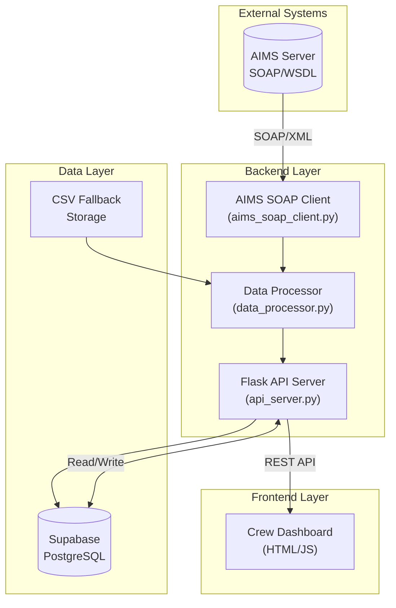
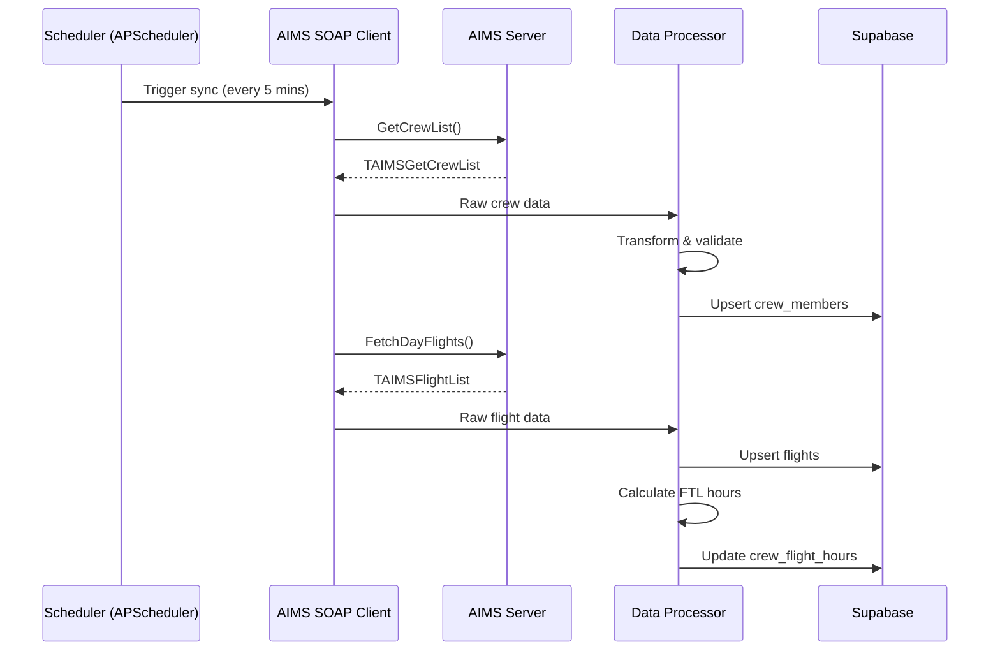

# Technical Specification Document
## Aviation Operations Dashboard - AIMS SOAP Integration

**Version:** 1.0  
**Ngày:** 30/01/2026  
**Tác giả:** Development Team

---

## 1. System Architecture

### 1.1 High-Level Architecture



### 1.2 Component Diagram

| Component | Technology | Responsibility |
|-----------|------------|----------------|
| `api_server.py` | Flask | REST API endpoints, routing |
| `aims_soap_client.py` | zeep/suds | AIMS SOAP communication |
| `data_processor.py` | Python | Data transformation, calculations |
| `crew_dashboard.html` | HTML/JS/CSS | User interface |
| Supabase | PostgreSQL | Data persistence |

---

## 2. AIMS SOAP Web Service Integration

### 2.1 Connection Configuration

```python
# AIMS WSDL Endpoint
AIMS_WSDL_URL = "http://{FQDN}/wtouch/AIMSWebService.exe/wsdl/IAIMSWebService"

# Authentication (stored encrypted)
AIMS_USERNAME = os.getenv("AIMS_WS_USERNAME")
AIMS_PASSWORD = os.getenv("AIMS_WS_PASSWORD")
```

### 2.2 SOAP Client Implementation

```python
from zeep import Client
from zeep.transports import Transport
from requests import Session

class AIMSSoapClient:
    def __init__(self, wsdl_url: str, username: str, password: str):
        session = Session()
        session.verify = True  # SSL verification
        transport = Transport(session=session, timeout=30)
        self.client = Client(wsdl_url, transport=transport)
        self.un = username
        self.psw = password
    
    def get_crew_list(self, from_date: date, to_date: date, 
                      base: str = "", ac_type: str = "", 
                      position: str = "") -> list:
        """
        Gọi GetCrewList API (Method #12)
        Returns: List of TAIMSGetCrewItm
        """
        response = self.client.service.GetCrewList(
            UN=self.un,
            PSW=self.psw,
            ID=0,  # 0 = all crew
            PrimaryQualify=True,
            FmDD=from_date.strftime("%d"),
            FmMM=from_date.strftime("%m"),
            FmYY=from_date.strftime("%Y"),
            ToDD=to_date.strftime("%d"),
            ToMM=to_date.strftime("%m"),
            ToYY=to_date.strftime("%Y"),
            BaseStr=base,
            ACStr=ac_type,
            PosStr=position
        )
        return response.GetCrewList
```

### 2.3 Key AIMS Methods Used

| Method | Purpose | Frequency |
|--------|---------|-----------|
| `GetCrewList` | Lấy danh sách crew và qualifications | Every 5 mins |
| `CrewMemberRosterDetailsForPeriod` | Chi tiết roster của crew | On-demand |
| `FetchDayFlights` | Danh sách flights trong ngày | Every 5 mins |
| `FetchFlightsFrTo` | Flights theo date range | On-demand |
| `CrewCheckIn` / `CrewCheckOut` | Check-in/out status | Real-time |
| `FetchCrewQuals` | Crew qualifications | Daily sync |

---

## 3. Data Models

### 3.1 Database Schema (Supabase)

```sql
-- Crew Members table
CREATE TABLE crew_members (
    id SERIAL PRIMARY KEY,
    crew_id VARCHAR(20) UNIQUE NOT NULL,
    crew_name VARCHAR(100) NOT NULL,
    first_name VARCHAR(50),
    last_name VARCHAR(50),
    three_letter_code VARCHAR(3),
    gender CHAR(1),
    base VARCHAR(10),
    email VARCHAR(100),
    cell_phone VARCHAR(20),
    employment_begin DATE,
    updated_at TIMESTAMP DEFAULT NOW(),
    source VARCHAR(10) DEFAULT 'AIMS'
);

-- Crew Qualifications
CREATE TABLE crew_qualifications (
    id SERIAL PRIMARY KEY,
    crew_id VARCHAR(20) REFERENCES crew_members(crew_id),
    qual_base VARCHAR(10),
    qual_aircraft VARCHAR(10),
    qual_position VARCHAR(10),
    roster_group SMALLINT,
    qual_begin_date DATE,
    qual_end_date DATE,
    is_primary BOOLEAN DEFAULT FALSE,
    updated_at TIMESTAMP DEFAULT NOW()
);

-- Crew Roster/Schedule
CREATE TABLE crew_roster (
    id SERIAL PRIMARY KEY,
    crew_id VARCHAR(20) REFERENCES crew_members(crew_id),
    duty_date DATE NOT NULL,
    duty_code VARCHAR(10),
    duty_description VARCHAR(100),
    start_time TIME,
    end_time TIME,
    flight_number VARCHAR(10),
    departure VARCHAR(5),
    arrival VARCHAR(5),
    aircraft_type VARCHAR(10),
    source VARCHAR(10) DEFAULT 'AIMS',
    updated_at TIMESTAMP DEFAULT NOW()
);

-- Standby Records
CREATE TABLE standby_records (
    id SERIAL PRIMARY KEY,
    crew_id VARCHAR(20),
    crew_name VARCHAR(100),
    duty_start_date DATE,
    duty_end_date DATE,
    status VARCHAR(10), -- SBY, SL, CSL
    base VARCHAR(10),
    source VARCHAR(10) DEFAULT 'AIMS',
    created_at TIMESTAMP DEFAULT NOW()
);

-- Flights
CREATE TABLE flights (
    id SERIAL PRIMARY KEY,
    flight_date DATE NOT NULL,
    carrier_code VARCHAR(3),
    flight_number INTEGER,
    leg_code VARCHAR(5),
    departure VARCHAR(5),
    arrival VARCHAR(5),
    std TIME,
    sta TIME,
    etd TIME,
    eta TIME,
    atd TIME,
    ata TIME,
    aircraft_reg VARCHAR(10),
    aircraft_type VARCHAR(10),
    status VARCHAR(20),
    delay_code VARCHAR(10),
    delay_minutes INTEGER,
    updated_at TIMESTAMP DEFAULT NOW()
);

-- Flight Hour Tracking
CREATE TABLE crew_flight_hours (
    id SERIAL PRIMARY KEY,
    crew_id VARCHAR(20),
    calculation_date DATE,
    hours_28_day DECIMAL(6,2),
    hours_12_month DECIMAL(8,2),
    warning_level VARCHAR(20), -- NORMAL, WARNING, CRITICAL
    updated_at TIMESTAMP DEFAULT NOW()
);
```

### 3.2 AIMS Data Type Mappings

| AIMS Type | Python Type | DB Type | Notes |
|-----------|-------------|---------|-------|
| `WideString` | `str` | `VARCHAR` | UTF-8 encoding |
| `Integer` | `int` | `INTEGER` | Crew ID, Flight Number |
| `Boolean` | `bool` | `BOOLEAN` | True/False flags |
| `Double` | `float` | `DECIMAL` | Fuel, coordinates |
| `Byte` | `int` | `SMALLINT` | Measurement units |

---

## 4. API Endpoints

### 4.1 REST API Design

| Method | Endpoint | Description |
|--------|----------|-------------|
| GET | `/api/dashboard/summary` | Dashboard KPIs |
| GET | `/api/crew` | List all crew (with filters) |
| GET | `/api/crew/{id}` | Crew detail with roster |
| GET | `/api/crew/{id}/roster` | Crew roster for period |
| GET | `/api/flights` | List flights (by date) |
| GET | `/api/flights/{id}` | Flight detail with crew |
| GET | `/api/standby` | Standby crew list |
| POST | `/api/upload/csv` | Upload CSV fallback data |
| GET | `/api/config/datasource` | Get current data source |
| POST | `/api/config/datasource` | Toggle AIMS/CSV |

### 4.2 Request/Response Examples

```json
// GET /api/dashboard/summary?date=2026-01-30
{
  "date": "2026-01-30",
  "data_source": "AIMS",
  "metrics": {
    "total_crew": 127,
    "crew_by_status": {
      "FLY": 85,
      "SBY": 12,
      "OFF": 20,
      "SL": 5,
      "CSL": 5
    },
    "active_flights": 45,
    "aircraft_utilization": 8.5,
    "total_block_hours": 382.5
  },
  "alerts": [
    {
      "type": "FTL_WARNING",
      "crew_id": "1234",
      "message": "28-day hours at 95 hours (95% of limit)"
    }
  ],
  "last_sync": "2026-01-30T15:55:00Z"
}
```

---

## 5. ETL Pipeline

### 5.1 AIMS Data Sync Flow



### 5.2 Error Handling

```python
class AIMSSyncError(Exception):
    """Custom exception for AIMS sync failures"""
    pass

def sync_with_retry(max_retries: int = 3):
    """Decorator for AIMS API calls with retry logic"""
    def decorator(func):
        def wrapper(*args, **kwargs):
            for attempt in range(max_retries):
                try:
                    return func(*args, **kwargs)
                except Exception as e:
                    if attempt == max_retries - 1:
                        logger.error(f"AIMS sync failed after {max_retries} attempts: {e}")
                        # Fallback to CSV mode
                        set_data_source("CSV")
                        raise AIMSSyncError(str(e))
                    time.sleep(2 ** attempt)  # Exponential backoff
        return wrapper
    return decorator
```

---

## 6. Security Implementation

### 6.1 Credential Management

```python
# Environment variables (never commit to repo)
AIMS_WS_USERNAME=your_username
AIMS_WS_PASSWORD=encrypted_password
SUPABASE_URL=https://xxxx.supabase.co
SUPABASE_KEY=your_service_key

# Encryption at rest
from cryptography.fernet import Fernet

def encrypt_credentials(password: str, key: bytes) -> str:
    f = Fernet(key)
    return f.encrypt(password.encode()).decode()
```

### 6.2 Access Control

| Role | Permissions |
|------|-------------|
| Admin | Full access, config changes |
| Operations | View all, upload CSV |
| Viewer | View dashboard only |

---

## 7. Performance Requirements

### 7.1 Benchmarks

| Metric | Target | Measurement |
|--------|--------|-------------|
| Dashboard load | < 3s | Time to first contentful paint |
| API response | < 2s | P95 latency |
| AIMS sync | < 30s | Full sync cycle |
| Concurrent users | 50+ | Load testing |

### 7.2 Caching Strategy

```python
from functools import lru_cache
from datetime import timedelta

# Cache dashboard summary for 1 minute
@lru_cache(maxsize=100)
def get_dashboard_summary(date: str, cache_key: str):
    # cache_key changes every minute to invalidate
    return calculate_summary(date)

# Redis caching for production
import redis
redis_client = redis.Redis(host='localhost', port=6379)
CACHE_TTL = 60  # seconds
```

---

## 8. Timezone Handling

> [!WARNING]
> AIMS data is in UTC. All display times must be converted to local timezone (GMT+7).

```python
from datetime import datetime
import pytz

UTC = pytz.UTC
LOCAL_TZ = pytz.timezone('Asia/Ho_Chi_Minh')  # GMT+7

def utc_to_local(utc_time: datetime) -> datetime:
    """Convert UTC time from AIMS to local timezone"""
    if utc_time.tzinfo is None:
        utc_time = UTC.localize(utc_time)
    return utc_time.astimezone(LOCAL_TZ)

def parse_aims_time(hh: str, mm: str) -> time:
    """Parse AIMS time format (separate HH:MM strings)"""
    return time(int(hh), int(mm))
```

---

## 9. Logging & Monitoring

### 9.1 Logging Configuration

```python
import logging

logging.basicConfig(
    level=logging.INFO,
    format='%(asctime)s - %(name)s - %(levelname)s - %(message)s',
    handlers=[
        logging.FileHandler('app.log'),
        logging.StreamHandler()
    ]
)

# AIMS-specific logger
aims_logger = logging.getLogger('aims_client')
aims_logger.setLevel(logging.DEBUG)
```

### 9.2 Health Checks

```python
@app.route('/health')
def health_check():
    checks = {
        'database': check_db_connection(),
        'aims_api': check_aims_connection(),
        'last_sync': get_last_sync_time()
    }
    status = 'healthy' if all(checks.values()) else 'degraded'
    return jsonify({'status': status, 'checks': checks})
```

---

## 10. Deployment Configuration

### 10.1 Environment Variables

```bash
# Production environment
FLASK_ENV=production
FLASK_DEBUG=0
AIMS_WSDL_URL=http://aims.company.com/wtouch/AIMSWebService.exe/wsdl/IAIMSWebService
AIMS_WS_USERNAME=api_user
AIMS_WS_PASSWORD=encrypted_password
SUPABASE_URL=https://xxxx.supabase.co
SUPABASE_KEY=production_key
SYNC_INTERVAL_MINUTES=5
```

### 10.2 Docker Configuration

```dockerfile
FROM python:3.11-slim

WORKDIR /app
COPY requirements.txt .
RUN pip install --no-cache-dir -r requirements.txt

COPY . .
EXPOSE 5000

CMD ["gunicorn", "--bind", "0.0.0.0:5000", "api_server:app"]
```

---

## Appendix A: AIMS Data Type Reference

Xem chi tiết trong [API_SOAP_WebService.md](./API_SOAP_WebService.md)
