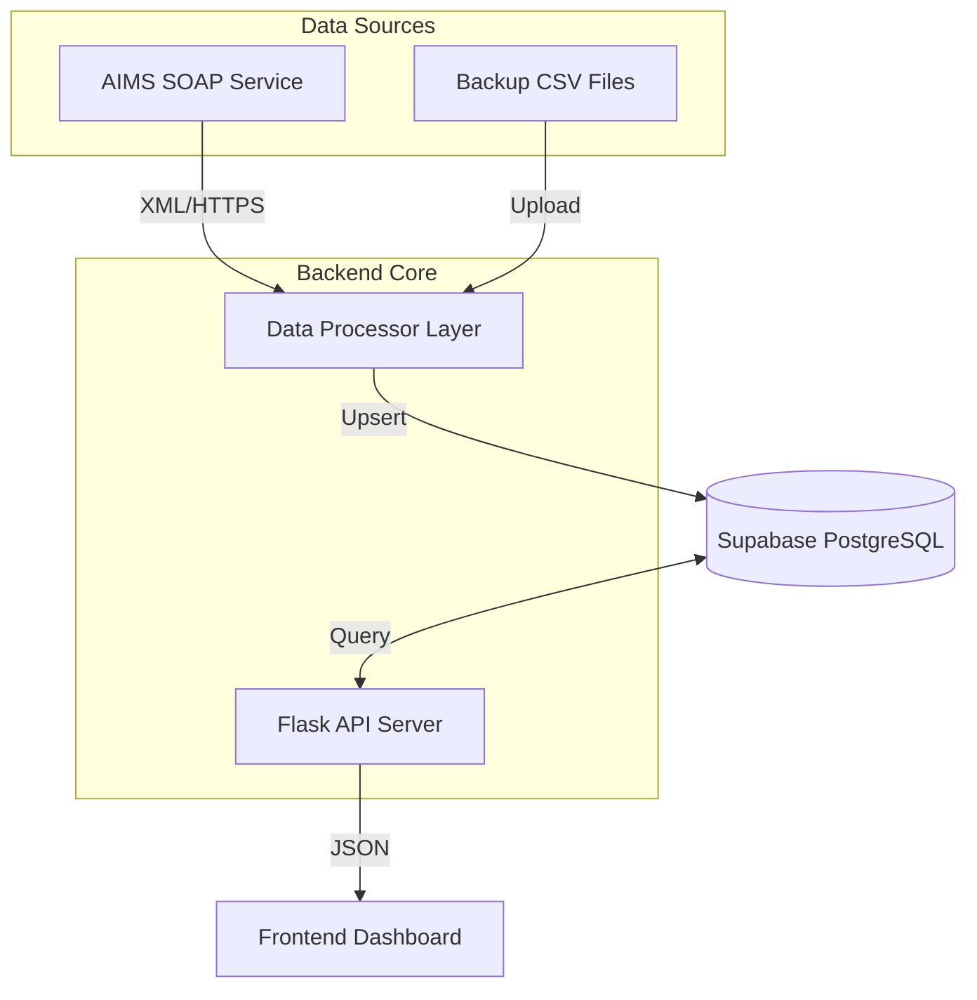

# TÀI LIỆU ĐẶC TẢ KỸ THUẬT (TECHNICAL SPECIFICATION)
## Aviation Operations Dashboard (Phiên bản Cập nhật)

**Ngày cập nhật:** 31/01/2026
**Trạng thái:** Đang phát triển (Phase 2 - Data Integration)

---

## 1. Tổng quan Dự án

Hệ thống **Aviation Operations Dashboard** là nền tảng quản lý vận hành hàng không tập trung, tích hợp dữ liệu từ hệ thống lõi AIMS thông qua giao thức SOAP Web Service. Hệ thống cung cấp cái nhìn toàn cảnh về nhân sự bay (Crew), lịch bay, và trạng thái vận hành theo thời gian thực.

### Mục tiêu chính
- Tự động hóa việc đồng bộ dữ liệu từ AIMS (Crew, Roster, Actuals).
- Cung cấp Dashboard theo dõi trực quan các chỉ số KPI vận hành.
- Giám sát tuân thủ quy định bay (FTL - Flight Time Limitations).
- Hỗ trợ xử lý tình huống khẩn cấp (AOG, Crew Shortage) với tính năng Swap & Pairing.

---

## 2. Kiến trúc Hệ thống

### 2.1 Sơ đồ tổng quát

### 2.2 Thành phần Công nghệ

| Thành phần | Công nghệ | Chi tiết |
|------------|-----------|----------|
| **Backend API** | Python Flask | RESTful API, xử lý logic nghiệp vụ, Routing. |
| **AIMS Client** | Zeep (Python) | SOAP Client kết nối AIMS WSDL, xử lý XML envelope. |
| **Database** | Supabase (PostgreSQL) | Lưu trữ quan hệ: Crew, Roster, Flights, FTL Logs. |
| **Scheduler** | APScheduler | Lập lịch đồng bộ dữ liệu nền (Background Jobs). |
| **Frontend** | HTML5 / JS / CSS | Giao diện tương tác, biểu đồ (Chart.js/D3.js). |

---

## 3. Chi tiết Tích hợp AIMS (AIMS Integration)

Hệ thống kết nối trực tiếp với AIMS Web Service để lấy dữ liệu.

### 3.1 Cấu hình Kết nối (`aims_soap_client.py`)
- **Protocol:** SOAP 1.1
- **Authentication:** Username/Password (truyền trong header hoặc body mỗi request).
- **Security:** SSL Verification enabled.

### 3.2 Các API Method Sử dụng
Chi tiết các hàm được mapping trong `aims_soap_client.py`:

| Method AIMS | Mục đích | Tần suất | Map tới DB Table |
|-------------|----------|----------|------------------|
| `GetCrewList` | Lấy danh sách phiếu bay, thông tin cơ bản | Daily | `crew_members` |
| `CrewMemberRosterDetailsForPeriod` | Lấy lịch làm việc chi tiết | 15 mins | `fact_roster` |
| `FlightDetailsForPeriod` / `GetCrewActuals` | Lấy giờ bay thực tế (Block Time) | 15 mins | `fact_actuals` |
| `FetchDayFlights` | Lấy danh sách chuyến bay trong ngày | 5 mins | `flights` |

### 3.3 Cơ chế Fallback (Dự phòng)
Trong trường hợp AIMS API gián đoạn hoạt động, hệ thống tự động chuyển sang chế độ **CSV Fallback Mode** (`data_processor.py`):
1. User upload file CSV báo cáo (RolCrTotReport, DayRepReport).
2. Hệ thống parse dữ liệu và update vào Database tương tự như nguồn API.
3. Dashboard vẫn hiển thị bình thường dựa trên dữ liệu mới nhất từ CSV.

---

## 4. Mô hình Dữ liệu (Update mới nhất)

Cấu trúc Database Schema trên Supabase đã được chuẩn hóa.

### 4.1 Bảng `crew_members`
Lưu thông tin nhân sự bay.
- `crew_id` (PK): Mã nhân viên.
- `base`: Sân bay căn cứ.
- `rank`: Cấp bậc (CPT, FO, PUR, CA).
- `status`: Trạng thái hiện tại (Active, Inactive).

### 4.2 Bảng `fact_roster`
Lưu lịch bay và nhiệm vụ.
- `activity_type`: Mã code (FLY, SBY, OFF, AL...).
- `start_dt`, `end_dt`: Thời gian bắt đầu/kết thúc (UTC -> Local).
- `flight_no`: Số hiệu chuyến bay (nếu có).

### 4.3 Bảng `crew_flight_hours` (FTL Monitoring)
Lưu kết quả tính toán giờ bay để cảnh báo an toàn.
- `hours_28_day`: Tổng giờ bay 28 ngày gần nhất.
- `hours_12_month`: Tổng giờ bay 12 tháng.
- `warning_level`: `NORMAL` | `WARNING` (>85h) | `CRITICAL` (>95h).

---

## 5. Các Tính năng Mới (New Features)

### 5.1 Quản lý Phi hành đoàn (Restored Crew Management)
- **File:** `templates/crew_dashboard.html`
- **Chức năng:**
    - Xem danh sách phi hành đoàn dạng lưới hoặc danh sách.
    - Filter theo Base, Aircraft Type, Qualification.
    - Xem chi tiết lịch bay (Roster) của từng cá nhân.

### 5.2 Phân tích Thay đổi Máy bay (Aircraft Swap)
- **File:** `templates/aircraft_swap.html`
- **Chức năng:**
    - Hỗ trợ mô phỏng đổi tàu bay (Tail Swap).
    - Cảnh báo ảnh hưởng tới lịch bay của tổ bay (Crew Impact Analysis).
    - Gợi ý phương án thay thế tối ưu.

### 5.3 Cảnh báo FTL Tự động (FTL Alerts)
- Hệ thống tự động tính toán lại giờ bay mỗi khi có dữ liệu Actuals mới từ AIMS.
- Hiển thị cảnh báo ngay trên Dashboard nếu phi công sắp vượt quá giới hạn bay (28 ngày/100h).

---

## 6. Bảo mật & Hiệu năng

### 6.1 Bảo mật (`api_server.py`)
- **Security Headers:** HSTS, X-Frame-Options, X-Content-Type-Options.
- **CORS:** Cấu hình chặt chẽ, chỉ cho phép domain được ủy quyền.
- **Rate Limiting:** Giới hạn số lượng request API để chống DDoS.

### 6.2 Hiệu năng
- **Frontend Caching:** Sử dụng LocalStorage để lưu cấu hình user.
- **Database Indexing:** Index trên các trường hay query (`crew_id`, `flight_date`).
- **Asynchronous Sync:** Việc đồng bộ dữ liệu AIMS chạy ngầm (Background Job) không làm treo giao diện người dùng.

---

## 7. Tài liệu Tham khảo (Reference)

- `README.md`
- `antigravity-awesome-skills/*`
- `docs/Technical_Specification.md` (Phiên bản tiếng Anh)

---
*Tài liệu này được soạn thảo tự động bởi AI Coding Assistant (Antigravity).*
